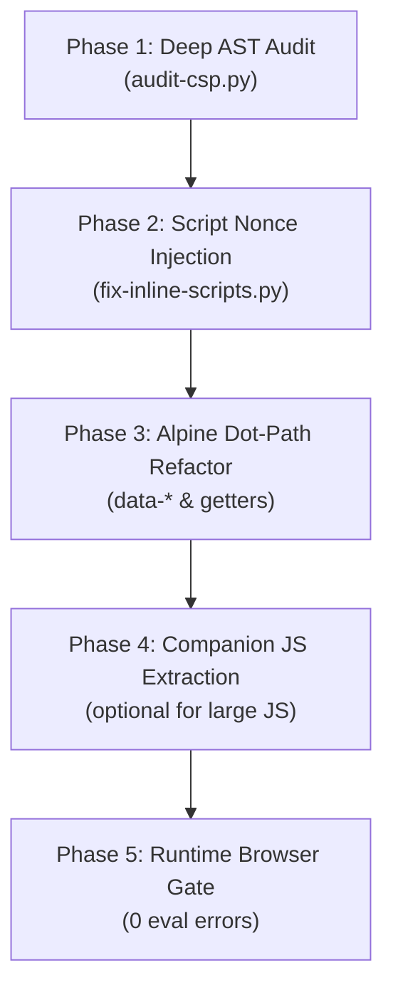

# Hyvä Compatibility Module — Strict CSP Upgrade Toolkit

> **A high-precision, automated toolkit and runbook for upgrading Hyvä compatibility modules, custom modules, and theme overrides to 100% Strict Content Security Policy (CSP) compliance.**

---

## 🛡️ Overview

This toolkit provides an automated, version-safe workflow to prepare and upgrade any Hyvä compatibility module (e.g. `Amasty_*HyvaCompatibility`, `Mirasvit_*`, custom B2B modules, or community packages) for strict Content Security Policy (`alpine3-csp.js` & Magento CSP nonce mode) without breaking backwards compatibility.

### Key Capabilities

- **Deep AST / Pattern Auditing**: Detect unsafe `$hyvaCsp` calls, un-nonced inline scripts, ternary directives, eval-like patterns, and Alpine event handlers with direct arguments.
- **Automated Script Nonce Injection**: Automatically wraps inline `<script>` tags with safe `isset($hyvaCsp) ? $hyvaCsp->registerInlineScript() : ''` nonces, preserving backward compatibility on Magento setups without Hyvä CSP module.
- **Alpine.js CSP Refactoring Helper**: Suggests production-tested refactor recipes for converting expressions into `data-*` attributes, dot-path function references, and companion JS objects.
- **FPC / Cache Pressure Verification**: Validates that inline script nonce registration does not poison Full Page Cache (FPC) or generate un-cacheable page variations under concurrent load.

---

## ⚡ Quick Start (CLI Runner)

All auditing, automated fixing, and refactoring recipes are wrapped in the unified `run.sh` CLI:

```bash
# 1. Verify environment and CSP packages
./run.sh doctor

# 2. Audit a module or template directory for CSP violations
./run.sh audit path/to/module/templates
# Or fail CI on warnings:
./run.sh audit path/to/module/templates --fail-on-warning --output json

# 3. Preview and automatically inject safe registerInlineScript nonces
./run.sh fix-scripts path/to/module/templates --dry-run
./run.sh fix-scripts path/to/module/templates

# 4. View Before/After refactoring recipes for complex Alpine expressions
./run.sh suggest path/to/template.phtml

# 5. Stress test FPC cache stability under load
./run.sh test-pressure https://mystore.local/catalog/product/view/id/123
```

---

## 🧭 5-Phase CSP Migration Workflow



### 1. Audit & Discovery (`audit`)
Scans target `.phtml` files for CSP antipatterns:
- Direct `$hyvaCsp->registerInlineScript()` calls lacking `isset($hyvaCsp)` check.
- Inline `<script>` tags missing CSP nonce injection.
- Alpine event directives with argument calls (e.g. `@click="select(item.id)"`).
- Ternary expressions inside `:class` or `:style`.
- Inline functions in `x-data`.

### 2. Nonce Injection (`fix-scripts`)
Safely transforms:
```php
<script>
    function initSomething() { ... }
</script>
```
Into backwards-compatible, CSP-compliant nonced script:
```php
<script <?= isset($hyvaCsp) ? $hyvaCsp->registerInlineScript() : '' ?>>
    function initSomething() { ... }
</script>
```

### 3. Alpine.js CSP Refactoring (`suggest`)
Under `alpine3-csp.js`, direct evaluation of arguments in HTML directives causes CSP violations. Use `suggest` to generate idiomatic transformations:
- **Pass data via HTML5 data-attributes**:
  ```html
  <!-- Before -->
  <button @click="addToCart(product.id, 'buy_now')">
  <!-- After -->
  <button :data-product-id="product.id" data-action="buy_now" @click="handleAddToCart">
  ```
- **Read data via event / element**:
  ```javascript
  handleAddToCart(event) {
      const productId = event.currentTarget.dataset.productId;
      const action = event.currentTarget.dataset.action;
      ...
  }
  ```

---

## 📚 References & Guides

Explore deep-dive documentation in the `references/` directory:
- [Alpine v3 CSP Rules & Migration Patterns](references/alpine3-csp-rules.md)
- [CSP Troubleshooting & Real-World Gotchas](references/csp-troubleshooting-gotchas.md)
- [Inline Script Injection Patterns](references/inline-script-patterns.md)

---

## 🛠️ Requirements

- **Bash** 4.0+
- **Python** 3.8+ (standard library only, no pip dependencies required for core auditing)
- **Magento 2.4.x** with Hyvä Themes
