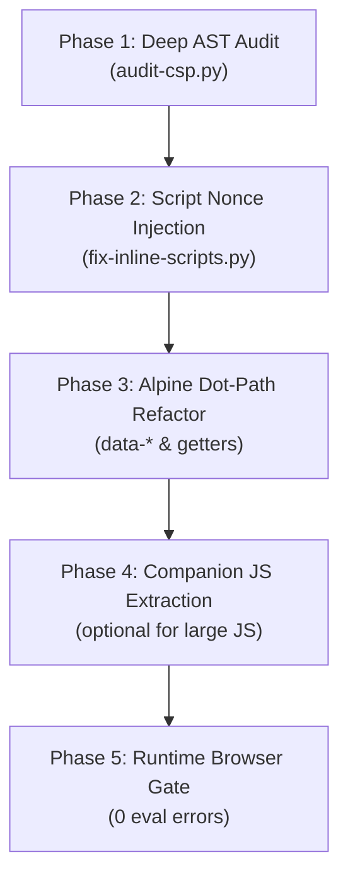

# Hyvä Compatibility Module — Strict CSP Upgrade Runbook

This skill provides an automated, version-safe workflow for upgrading any Hyvä compatibility module (e.g. `Amasty_*HyvaCompatibility`, `Mirasvit_*`, custom B2B modules, or community compatibility packages) to **100% Strict Content Security Policy (CSP)** compliance without breaking backwards compatibility.

---

## ⚡ Quick Start (CLI Runner)

All auditing, automated fixing, and refactoring recipes are wrapped in the unified CLI runner:

```bash
# 1. Verify environment and CSP packages
./.agents/skills/hyva-compat-csp-update/run.sh doctor

# 2. Audit a module or template directory for CSP violations
./.agents/skills/hyva-compat-csp-update/run.sh audit <path/to/module>

# 3. Preview and automatically inject safe registerInlineScript nonces
./.agents/skills/hyva-compat-csp-update/run.sh fix-scripts <path/to/module> --dry-run
./.agents/skills/hyva-compat-csp-update/run.sh fix-scripts <path/to/module>

# 4. View Before/After refactoring recipes for complex Alpine expressions
./.agents/skills/hyva-compat-csp-update/run.sh suggest <path/to/template.phtml>
```

---

## 🧭 5-Phase CSP Migration Workflow



---

### 📋 Phase 1: Audit & Discovery

Run the auditor against your target compatibility module:
```bash
./.agents/skills/hyva-compat-csp-update/run.sh audit path/to/module
```

The auditor checks for:
1. **Unsafe `$hyvaCsp` Calls:** `$hyvaCsp->registerInlineScript()` without `isset($hyvaCsp)`.
2. **Un-nonced Inline `<script>` Tags:** Executable scripts lacking CSP hash/nonce registration.
3. **Alpine Argument Calls:** Direct calls passing arguments (`@click="select(item.id)"`).
4. **Ternary Operators in Directives:** `:class="active ? 'a' : 'b'"`.
5. **Object Literals in Bindings:** `:class="{ 'active': isSelected }"`.
6. **Binary String Concatenation:** `:id="'item-' + id"`.
7. **Inline Function / Arrow Definitions:** `@click="() => doSomething()"`.
8. **Alpine v2 Directives:** `x-spread`, `$el.__x`.

---

### ⚡ Phase 2: Automated Inline Script Nonce Registration

Hyvä Theme inspects PHP's output buffer (`ob_get_contents()`) for the last closed `</script>` tag. Therefore, `registerInlineScript()` **MUST be placed immediately after `</script>`**, NEVER inside the `<script>` tag. To prevent fatal PHP crashes when the CSP module is disabled, the call must be guarded with `isset($hyvaCsp)`.

1. **Preview proposed diffs:**
   ```bash
   ./.agents/skills/hyva-compat-csp-update/run.sh fix-scripts path/to/module --dry-run
   ```
2. **Apply changes automatically:**
   ```bash
   ./.agents/skills/hyva-compat-csp-update/run.sh fix-scripts path/to/module
   ```
   This safely injects:
   ```html
   <script>
       // ... existing code
   </script>
   <?php isset($hyvaCsp) && $hyvaCsp->registerInlineScript(); ?>
   ```

---

### 🛠️ Phase 3: Alpine.js Dot-Path & Evaluator Refactoring

Under Hyvä strict CSP, `alpine3-csp.js` evaluates expressions strictly via dot-splitting (`scope.key`). It cannot parse complex JavaScript strings or argument lists.

Use the recipe generator to see exact refactoring patterns:
```bash
./.agents/skills/hyva-compat-csp-update/run.sh suggest path/to/template.phtml
```

#### Core Transformation Rules:

| Anti-Pattern (Fails under CSP) | Solution (100% CSP Compliant) |
|---|---|
| `<script><?php isset($hyvaCsp)...?></script>` | Place `<?php isset($hyvaCsp) && $hyvaCsp->registerInlineScript(); ?>` **immediately AFTER `</script>`** |
| `@click="select(item.id)"` | `<button @click="select" data-id="<?= ... ?>">` + `event.currentTarget.dataset.id` |
| `x-data="initFilter({ code: 'a' })"` | `<div x-data="initFilter" data-code="a">` + `this.$el.dataset.code` in `init()` |
| `x-data="{ count: 0 }"` | `<div x-data="initCounter">` + register component via `Alpine.data` |
| `x-show="type === 'video'"` | `x-show="isVideo"` + Alpine getter `get isVideo() { return this.type === 'video'; }` |
| `:class="isOpen ? 'block' : 'hidden'"` | `:class="displayClass"` + Alpine getter `get displayClass()` |
| `:class="{ 'active': isSelected }"` | `:class="itemClass"` + return string or array from getter |
| `:id="'prefix-' + id"` | `:id="elementId"` + compute full string in Alpine getter |
| `x-spread="eventListeners"` | Remove legacy v2 directive; bind discrete `@click`, `@keydown` listeners directly |
| `[x-data="initFoo()"]` in CSS | Use substring matcher `[x-data*="initFoo"]` to support modernized CSP syntax |

👉 **Read full evaluator mechanics & code examples:** [references/alpine3-csp-rules.md](./references/alpine3-csp-rules.md)  
👉 **Read deep-dive gotchas & root-cause analysis:** [references/csp-troubleshooting-gotchas.md](./references/csp-troubleshooting-gotchas.md)

---

### 🚨 Critical Gotchas & Edge Cases (Summary)

1. **Output Buffer Requirement:** `HyvaCsp::registerInlineScript()` reads `ob_get_contents()` for the last closed script. It **must be placed after `</script>`**.
2. **Fallback Theme Safety:** Bare `$hyvaCsp->...` throws a fatal error if CSP is disabled. **Always wrap in `isset($hyvaCsp)`**.
3. **`x-for` Loop Scope Mechanics:** Keep direct dot-path accesses (`x-html="item.name"`, `:id="item.id"`) native. Do NOT wrap in root getters unless complex logic is required, and standardize the loop iterator name to `(item, index) in items`.
4. **Dynamic Trees & Hierarchies:** Guard recursive child traversal with optional chaining (`if (!tree?.children?.length) return;`).

---

### 📦 Phase 4: Companion JS Architecture (Externalization)

For complex compatibility modules with large JavaScript blocks:
1. Extract large component factories from `.phtml` into `view/frontend/web/js/component.js`.
2. Register the component on `alpine:init`:
   ```javascript
   document.addEventListener('alpine:init', () => {
       Alpine.data('initMyModule', () => ({ ... }));
   });
   ```
3. Load via layout XML `<head><script src="Vendor_Module::js/component.js"/></head>`. External script files do not require per-block nonces!

👉 **Read companion JS best practices:** [references/inline-script-patterns.md](./references/inline-script-patterns.md)

---

### 🚦 Phase 5: Verification Gate

Before merging or publishing the compatibility module:
1. Re-run audit to ensure **0 fatal findings**:
   ```bash
   ./.agents/skills/hyva-compat-csp-update/run.sh audit path/to/module --fail-on-warning
   ```
2. Clean Magento cache:
   ```bash
   bin/magento cache:clean
   ```
3. Verify browser console on storefront:
   - **0 Refused to evaluate a string as JavaScript (`unsafe-eval`)**
   - **0 Refused to execute inline script because it violates Content Security Policy**
   - **0 Alpine Expression Error**
4. **Runtime Verification Under Cache Pressure (Sutunam Concurrency Protocol):**
   ```bash
   ./.agents/skills/hyva-compat-csp-update/run.sh test-pressure https://mystore.local/path
   ```
   - Cold cycle (5 concurrent requests): verifies no FPC race or dropped CSP headers.
   - Warm cycle (40 repeated requests): verifies constant CSP header size (0 dynamic hash growth).
