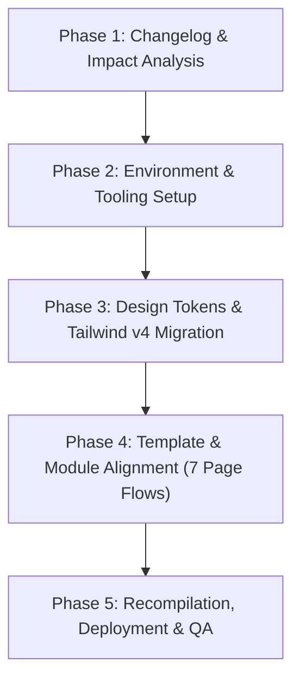
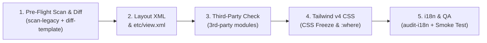
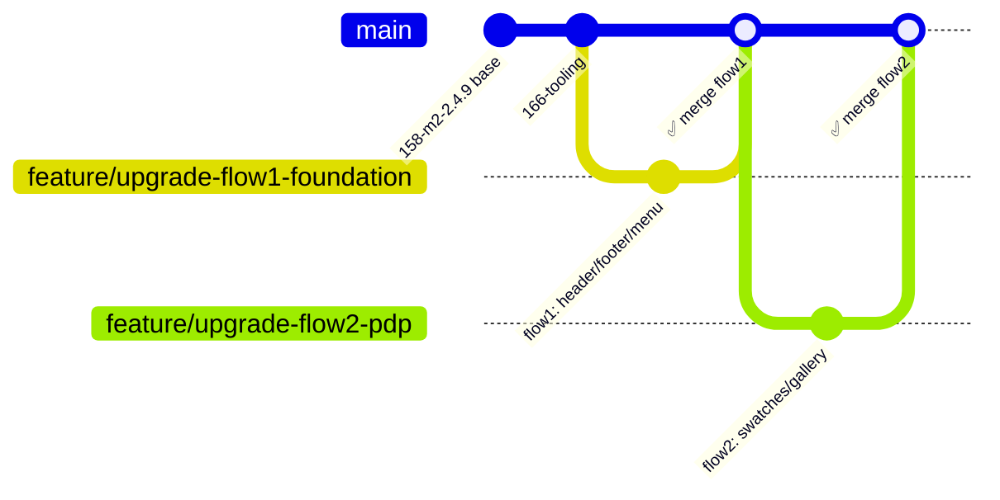

# Hyvä Theme Upgrade — Universal Runbook

This skill provides a version-aware, project-configurable workflow for upgrading any Hyvä Theme child theme on Magento 2 / Adobe Commerce. It covers Hyvä Theme Module & Default Theme upgrades, Tailwind CSS v3→v4 migration, and Hyvä Commerce module alignment.

> [!IMPORTANT]
> **Always start by creating `.hyva-upgrade.json`** from the sample file and setting `from_version`/`to_version`. All audit scripts and `fetch-changelog.py` read this file to scope their checks to your exact upgrade range.
>
> ```bash
> cp .agents/skills/hyva-theme-upgrade/.hyva-upgrade.json.sample .hyva-upgrade.json
> # Then edit: from_version, to_version, themePath, baselineUrl, targetUrl
> ```

> [!NOTE]
> **Universal & Project-Configurable Architecture:**
> This skill uses **auto-discovery** for theme path and locales, and reads version ranges from `.hyva-upgrade.json`.
> All scripts are portable across projects — no hardcoded paths or versions.
> ```json
> {
>   "from_version": "1.4.3",
>   "to_version": "1.5.2",
>   "themePath": "app/design/frontend/Vendor/theme",
>   "vendorThemePath": "vendor/hyva-themes/magento2-default-theme",
>   "baselineUrl": "https://staging.domain.com",
>   "targetUrl": "https://domain.test",
>   "cssFreeze": true,
>   "strictCsp": false,
>   "locales": ["en_US", "fr_FR"],
>   "commerce_versions": {
>     "cms": { "from": "1.1.0", "to": "1.2.4" }
>   }
> }
> ```
> - **CSS Freeze:** Set `cssFreeze: true` to block any changes to `web/tailwind/**/*.css` on projects with customized Brand Design Systems.
> - **CSP Mode:** Check `<?php isset($hyvaCsp) && $hyvaCsp->registerInlineScript(); ?>` if the merchant enforces strict CSP nonces.
> - **Container Execution:** In containerized setups (Govard, DDEV, Warden), always execute npm/make commands inside the container.

---

## 🧭 Workflow Overview



---

## 📋 Phase 1: Changelog & Impact Analysis

Before modifying any theme code, dynamically fetch the architectural shifts and breaking changes scoped to your exact upgrade range configured in `.hyva-upgrade.json`:

```bash
# Automatically extract changelog sections matching from_version -> to_version:
./run.sh changelog
```

### Key Architectural Shift Milestones (Universal Reference)
Cross-reference your project's upgrade range (`from_version` → `to_version`) against these major official milestones:

| Hyvä Milestone | Key Architectural Shift | Critical Impact / Action Needed |
|---|---|---|
| **Hyvä 1.4.0** | **Tailwind CSS v4 Introduction** | CSS-first configuration (`@theme`), replaced `tailwind.config.js`. Note: detect Tailwind version directly from `web/tailwind/package.json`. |
| **Hyvä 1.4.10** | **BrowserSync & bfcache Fix** | `window.BASE_URL` compatibility fix; bfcache `@pageshow.window` restoration for back/forward navigation. |
| **Hyvä 1.5.1** | **PHP-rendered Swatches & Gallery** | Swatches/Gallery pre-rendered in server HTML (eliminates PDP CLS). Introduces layout container `gallery.additional`. **Mandatory:** Bump `tailwindcss` to `>= 4.3` in `web/tailwind/package.json` for logical properties (`ms-`, `me-`). |
| **Hyvä 1.5.2** | **Design Token Modernization (`fg` → `ink`)** | `--color-ink` and `--color-ink-muted` replace legacy `--color-primary-fg`; new i18n accessibility phrases introduced. Note: `fg` token alias is kept as fallback, plan tech debt migration to `ink`. |

> [!NOTE]
> **Optional Modules (Hyvä Commerce / Enterprise Suite):**
> If your project uses optional commercial packages (such as `commerce-module-cms`, `commerce-module-admin-dashboard`, `commerce-module-media-optimization`, or `magento2-hyva-enterprise-*`), specify their versions in `.hyva-upgrade.json` under `"commerce_versions"`. Run `./run.sh changelog --module commerce` to review their specific changes. For full static reference docs, see [changelog-theme-upgrade.md](./references/changelog-theme-upgrade.md) and [changelog-commerce-modules.md](./references/changelog-commerce-modules.md).

---

## ⚙️ Phase 2: Environment & Tooling Setup

### Container / Docker Execution Rules (Govard, DDEV, Warden, native Docker)
When running inside containerized environments (especially Alpine-based musl containers):
1. **Never run native `npm` commands directly on a Linux glibc host** that could install incompatible native binaries (e.g. `lightningcss.linux-x64-gnu.node` instead of `linux-x64-musl.node`). Always use your environment container runner (e.g. `govard tool npm`, `ddev npm`, `warden env exec ...`) or the project `Makefile`.
2. **Persistent npm Cache:** Configure npm cache within the project workspace (e.g. `var/.npm-cache`) to avoid container root-permission errors (`EACCES: /.npm`):
   ```makefile
   NPM := $(ENV_BIN) tool npm --cache /var/www/html/var/.npm-cache
   ```
3. **BrowserSync Configuration:**
    * Target Proxy must point to the local store domain (e.g., `https://your-store.test/`).
    * Set `open: false` to avoid headless container errors.
    * Allow self-signed local TLS: `process.env.NODE_TLS_REJECT_UNAUTHORIZED = '0'`.
    * Add `--output-sync=line` to parallel `make run_dev` to avoid mangled terminal output.

### Environment Setup Command Sequence
Run in this exact order when setting up a fresh environment:
```bash
# 1. Install npm dependencies (runs inside Govard container via Makefile)
make npm_install

# 2. Verify CSS build compiles cleanly
make build

# 3. Start dev watcher (Tailwind v4 incremental rebuild)
make watch

# 4. (Optional) Start browser-sync proxy for live reload
make browser_sync

# 5. Or start both watcher + browser-sync concurrently:
make run_dev
```

---

## 🎨 Phase 3: Design Tokens & Tailwind v4 Migration

### 1. Tailwind v4 Architecture
Tailwind v4 eliminates `tailwind.config.js` and `postcss.config.js` in favor of a native CSS entry point:
* **Entry file:** `web/tailwind/tailwind-source.css`
* **Directives:**
  ```css
  @import "@hyva-themes/hyva-modules/css";
  @import "tailwindcss" source(none);

  @source "../../**/*.phtml";
  @source "../../**/*.xml";
  @source "../../../../../../../vendor/hyva-themes/magento2-default-theme/**/*.phtml";
  @source "../../../../../../../app/code/**/*.phtml";

  @import "./generated/hyva-source.css";
  @import "./generated/hyva-tokens.css";
  ```

### 2. Design Token Migration (`fg` → `ink`)
* Verify `@theme` defines both the new `ink` tokens and backward-compatible `fg` aliases:
  ```css
  @theme {
      --color-ink: var(--color-slate-950);
      --color-ink-muted: var(--color-slate-600);
      --color-fg: var(--color-ink);
      --color-fg-secondary: var(--color-ink-muted);
  }
  ```
* Search child theme templates and CSS components for legacy classes:
  ```bash
  grep -rnE "(text|bg|border|fill|stroke)-fg\b" app/design/frontend/<Vendor>/<theme>/
  ```
  Replace occurrences with `text-ink`, `text-ink-muted`, `bg-ink`, etc., as appropriate.

---

## 🛠️ Helper Scripts

### 1. audit-theme.py (Version-Aware Pre-Flight Auditor)
Scans any Hyvä child theme for upgrade compatibility issues. **Reads `from_version`/`to_version` from `.hyva-upgrade.json`** to only check patterns relevant to your upgrade range.

```bash
# Auto-discover theme, use version range from .hyva-upgrade.json:
python3 .agents/skills/hyva-theme-upgrade/scripts/audit-theme.py

# Explicit theme path + PHP lint:
python3 .agents/skills/hyva-theme-upgrade/scripts/audit-theme.py --theme app/design/frontend/Vendor/theme --lint-php

# Skip vendor-alignment warnings (use when Amasty/3rd-party replaces gallery templates):
python3 .agents/skills/hyva-theme-upgrade/scripts/audit-theme.py --skip-vendor-align

# JSON output for CI integration:
python3 .agents/skills/hyva-theme-upgrade/scripts/audit-theme.py --output json > audit-report.json

# Exit code: 0 = clean, 1 = fatal issues found (enables use in CI gates)
```

### 2. diff-template.sh (Template Comparison with Vendor)
Instantly compares any customized child template against its target vendor counterpart or 3rd-party vendor module using standard POSIX `diff -u` (no git required):

```bash
# Syntax: ./.agents/skills/hyva-theme-upgrade/scripts/diff-template.sh <Module/path/template.phtml>

# Example — PDP gallery:
./.agents/skills/hyva-theme-upgrade/scripts/diff-template.sh Magento_Catalog/templates/product/view/gallery.phtml

# Example — Header:
./.agents/skills/hyva-theme-upgrade/scripts/diff-template.sh Magento_Theme/templates/html/header.phtml

# Example — 3rd-party override (auto-detects vendor/* counterpart):
./.agents/skills/hyva-theme-upgrade/scripts/diff-template.sh Amasty_ColorSwatchesProHyva/templates/product/view/conf.phtml
```

### 3. scan-legacy-directives.sh (Legacy Directives & Form Specificity Scanner)
Scans customized theme templates for obsolete Alpine v2 syntax (`x-spread`), undefined `x-bind` targets, and CSS unlayered form label specificity:

```bash
# Scan entire theme:
./.agents/skills/hyva-theme-upgrade/scripts/scan-legacy-directives.sh

# Scan specific module in active flow:
./.agents/skills/hyva-theme-upgrade/scripts/scan-legacy-directives.sh Magento_Checkout
```

### 4. audit-i18n.py (Automated Multi-Locale Translation Auditor)
Audits customized templates for `__('...')` phrases and verifies coverage across all active language dictionaries in `i18n/*.csv`:

```bash
# Audit entire theme across all theme locales:
python3 .agents/skills/hyva-theme-upgrade/scripts/audit-i18n.py

# Audit specific locale or module:
python3 .agents/skills/hyva-theme-upgrade/scripts/audit-i18n.py --locale fr_FR Magento_Catalog
```

### 5. visual-diff.sh / visual-diff.py (Automated Visual Diff & PerfectPixel)
Captures Headless Chrome screenshots comparing local upgraded pages against the baseline staging site, computing exact pixel delta and generating an interactive HTML swipe report:

```bash
# Run visual diff for a page:
./.agents/skills/hyva-theme-upgrade/scripts/visual-diff.sh contactez-nous
```

---

## 🔍 Phase 4: Template & Module Alignment (7 Page Flows)

To safely upgrade ~360+ customized theme files without regressions, execution is organized by **Page Flow (User Journey)** using the **Standard 5-Step SOP**.

### 🔄 Standard 5-Step SOP per Page / Module



1. **Step 1: Pre-Flight Scan & Template Diff (`.phtml`):**
    * Run `scan-legacy-directives.sh` on the flow's modules to catch any Alpine v2 legacy syntax (`x-spread`, undefined `eventListeners`, `$el.__x`).
    * Run `diff-template.sh` for each customized template in the flow against target vendor code.
    * Adopt PHP-rendered Swatches (`.swatch-option` styling) and PHP-rendered Gallery (`gallery.additional`).
2. **Step 2: Layout XML & `etc/view.xml` Alignment:**
    * Run `./run.sh layout` to automatically audit all child layout XML files for orphaned `<referenceBlock>`, `<referenceContainer>`, and `<move>` targets against upstream vendor layouts.
    * Verify `theme.xml` parent inheritance and `web/tailwind/package.json` dependency alignment (Tailwind >= 4.3 for logical properties).
    * Verify aspect ratios and thumbnail sizes in `etc/view.xml`.
3. **Step 3: Third-Party Compatibility:**
    * Review all 3rd-party module overrides in your child theme (`vendor/*` sources).
    * Ensure third-party JS does not target obsolete Alpine selectors (e.g., `[x-data*=initConfigurable]`) or rely on deprecated data factory signatures.
    * **Amasty Gallery Script Extraction (`initAmGallery`) — if applicable:** On Hyvä >= 1.5, Amasty separates the Alpine component script out of `gallery.phtml` into `templates/js/amgallery-component-script.phtml`. When porting or creating this theme override:
        * **Reflow/Layout Thrashing Protection:** Cache `_cachedActiveImgRect` and throttle `handleMouseMove` via `requestAnimationFrame` (`_mouseMoveRafId`) for Drift Zoom to prevent heavy layout thrashing.
        * **CLS / LCP Preservation:** In `gallery.phtml`, preserve `fetchpriority="high"` on placeholder image and omit `x-cloak` on `#am-gallery` to maintain CLS = 0. Keep `gallery.additional`.
4. **Step 4: Styling Preservation & Tailwind Build Verification (CSS Freeze):**
    * **Do NOT modify theme CSS files (`web/tailwind/**/*.css`)** or rewrite custom template classes unless an active compilation error occurs.
    * Verify any global element styling (like form labels) uses `@layer base` and `:where(...)` to avoid clobbering utility classes.
    * Preserve 100% of existing visual styles, colors, and layout classes.
    * Run `make build` to verify clean Tailwind v4 compilation without syntax or nesting errors.
5. **Step 5: i18n, Visual Diff & QA Acceptance:**
    * Run `audit-i18n.py` on the flow's modules to identify any missing translations and add them to your locale CSV files.
    * Run the automated **Visual Diff & PerfectPixel Tool** to compare against live dev:
      ```bash
      ./.agents/skills/hyva-theme-upgrade/scripts/visual-diff.sh hygiene-securite/xl.html
      ```
      Inspect the interactive HTML report (`index.html`) with Split Swipe and Onion Skin to catch any margin/padding/typography deviations.
    * Confirm **CLS = 0** on PDP and PLP.
    * Run the mandatory **Cross-Functional Smoke Test** (see 🛡️ Global Functions section below).

### 🗺️ The 7 Page Flows & Detailed Matrix

Refer to the complete file tracking matrix and checklist in:
👉 [references/upgrade-matrix-by-page.md](./references/upgrade-matrix-by-page.md)

| Flow | Page / Area | Key Risk / Focus | Branch Name |
| :---: | :--- | :--- | :--- |
| 1 | **Global / Foundation** (Header, Footer, Menu, Breadcrumbs, HTML Dialog 2.3.0) | Dialog `modeless`, Sticky header JS | `feature/upgrade-flow1-foundation` |
| 2 | **PDP** (PHP Swatches, PHP Gallery, Configurable options, `etc/view.xml`) | **Highest risk:** 3rd-party swatch JS vs PHP swatches, `gallery.additional` | `feature/upgrade-flow2-pdp` |
| 3 | **PLP & Search** (Product Cards, Layered Navigation / Filters, Search Popup) | Filter AJAX reload state, pagination | `feature/upgrade-flow3-plp` |
| 4 | **Cart & Mini-cart** (Drawer, Ajax Add-to-Cart, Totals) | `toggle-cart` event chain, cart drawer | `feature/upgrade-flow4-cart` |
| 5 | **Hyvä Checkout** (Magewire steps, Address, Payment methods) | Magewire `wire:auto-save`, payment renderers | `feature/upgrade-flow5-checkout` |
| 6 | **Customer Account** (Dashboard, Login/Register, Order History, B2B if present) | `isSubmitting` guards, bfcache `@pageshow` | `feature/upgrade-flow6-account` |
| 7 | **CMS, Brand Pages & 3rd-Party Vendor Overrides** (Hyvä CMS `auto_attributes`, PageBuilder, Upstream Vendor Overrides) | Upstream module changes detected via `./run.sh vendor` | `feature/upgrade-flow7-cms` |

> [!TIP]
> **🧩 Third-Party Vendor Overrides Strategy (Amasty, Mirasvit, Mageplaza, etc.):**
> - **Only touch overrides when vendor updates:** Child-theme overrides for 3rd-party modules only need updating when `composer update` updated the upstream package in `vendor/` and introduced breaking changes or new features. If a vendor package did not change in `vendor/`, **do not touch its working overrides**.
> - **Automated vendor discovery:** Run `./run.sh vendor` to instantly list which vendor module templates differ from the installed upstream versions.
> - **CSP Scope Discipline:** Unless your store explicitly enables strict CSP (`strictCsp: true`), Magento and Alpine run without strict CSP by default. **Do not waste time refactoring working 3rd-party templates for strict CSP dot-path compliance** unless strict CSP nonces are actively enforced.
> - **Dedicated Strict CSP Toolkit:** When upgrading compatibility modules, custom modules, or theme overrides for strict CSP compliance, use the dedicated companion skill **`hyva-compat-csp-update`** (`.agents/skills/hyva-compat-csp-update/run.sh audit|fix-scripts|suggest|test-pressure`).

---

## 🛡️ Global Functions & Events Protection Protocol

> [!WARNING]
> This protocol applies **across all 7 flows**. Violating any rule here risks silent JS breakage that may not surface until the customer performs an action (e.g., adds to cart) in production.

In Hyvä Themes, modules communicate via **Window Global APIs** and **Document CustomEvents**. Refactoring any template must strictly respect the following:

### 1. The Global Contracts Inventory

| Global Bridge | Dispatcher | Listener / Receiver | Risk if Broken |
| :--- | :--- | :--- | :--- |
| `window.dispatchMessages(messages)` | Add-to-cart, wishlist, form submit | Header notification container | No visual feedback to user after actions |
| `CustomEvent('reload-customer-section-data')` | Cart update, wishlist toggle, auth | Magento private customer-data | Cart counter stops updating |
| `CustomEvent('toggle-cart')`<br>*(or 3rd-party Ajax cart events)* | PDP / PLP add-to-cart | Ajax cart modules & Drawer mini-cart | Mini-cart popup/drawer never opens |
| `CustomEvent('update-gallery-images')`<br>`CustomEvent('update-prices')` | Swatch option click | PDP Gallery & Price block | Gallery image & price do not switch |

### 2. The 3 Invariant Refactoring Rules

1. **Rule 1 - Never Mutate Event Signatures:** Never rename or alter the payload of `dispatchMessages`, `reload-customer-section-data`, `toggle-cart`, or 3rd-party Ajax cart events.
2. **Rule 2 - Preserve Functional DOM Selectors:** When migrating to Tailwind v4 class names, **never remove functional IDs or attribute selectors** queried by other scripts:
    * `#product-addtocart-button`, `.swatch-attribute`, `.swatch-option`, `[data-gallery-role=gallery]`
3. **Rule 3 - Pre-edit Impact Scan:** Before modifying any JS-bearing template:
   ```bash
   grep -rnE "(dispatchMessages|reload-customer-section-data|toggle-cart|update-gallery)" app/design/frontend/<Vendor>/<theme>/
   ```

### 3. Cross-Functional Smoke Test (Mandatory After Every Flow)

After each flow is complete, run this 3-point validation before marking `[x] Done`:

| # | Test Action | What to Verify |
| :---: | :--- | :--- |
| 1 | **Add to cart** from any page in the flow | Toast appears (`dispatchMessages`), header counter increments (`reload-customer-section-data`), mini-cart drawer opens (`toggle-cart`) |
| 2 | **Login / Logout** as customer | Header greeting updates, wishlist badge reflects correct count |
| 3 | **Select swatch on PDP** (color/size) | Gallery image switches, price updates synchronously |

---

## 🚀 Phase 5: Recompilation, Deployment & Verification

### Full Rebuild Sequence

> [!IMPORTANT]
> Replace `<LOCALES>` with the locales from your `.hyva-upgrade.json` `locales` array, and adjust the Magento CLI tool (`govard env exec`, `bin/magento`, `php`, etc.) to match your environment.

```bash
# Read locales from config (example: jq output)
LOCALES=$(jq -r '.locales | join(" ")' .hyva-upgrade.json 2>/dev/null || echo "en_US")

# 1. Reinstall npm deps (run inside container to get correct native binaries)
make npm_install

# 2. Compile Tailwind v4 CSS
make build

# 3. Magento DI compile
php bin/magento setup:di:compile

# 4. Deploy static assets for all project locales
php bin/magento setup:static-content:deploy $LOCALES -f

# 5. Full cache flush
php bin/magento cache:flush
```

> [!NOTE]
> **Container environments (Govard/DDEV/Warden):** Prefix `php bin/magento` commands with your container exec wrapper (e.g. `govard env exec php bin/magento ...`).

### Verification Checklist

```bash
# Verify dev watcher rebuilds on file change
make watch

# Verify browser-sync proxy to targetUrl from .hyva-upgrade.json
make browser_sync
```

* [ ] `make build` produces `web/css/styles.css` with 0 errors.
* [ ] `./.agents/skills/hyva-theme-upgrade/run.sh doctor` reports environment and dependencies are ready.
* [ ] `./.agents/skills/hyva-theme-upgrade/run.sh audit` exits with code 0 (or with `--strict-csp` if enforcing strict CSP).
* [ ] `./.agents/skills/hyva-theme-upgrade/run.sh vendor --csp-only` exits with 0 alerts.
* [ ] **Translation & Code Review Gate:** Review `git diff` for all modified templates:
  * Verify NO `__('...')` translation strings were altered, broken, or mismatched from `i18n/*.csv`.
  * Verify NO emojis (`😔`, etc.) or unwanted artifacts were copied from 3rd-party vendor templates.
  * Verify NO dynamic script hash bloat (`uniqid()`) inside inline `<script>`.
* [ ] **Runtime Frontend Verification Gate:**
  * Clean cache inside container: `govard env exec php bin/magento cache:clean` (or `docker exec <container> bin/magento cache:clean`).
  * Verify `pub/static/deployed_version.txt` does not contain a trailing newline (`\n` breaks `THEME_PATH` and causes `hyva-variables.js SyntaxError: Invalid or unexpected token`).
  * Check browser console / network response: **0 SyntaxError**, **0 ReferenceError** (`BASE_URL is not defined`), **0 Alpine Expression Error**.
* [ ] All page flows marked `[x] Done` in [upgrade-matrix-by-page.md](./references/upgrade-matrix-by-page.md).
* [ ] Cross-functional smoke test passes on staging.
* [ ] PageSpeed CLS = 0 on PDP and PLP (measure with Chrome DevTools or Lighthouse).

---

## 🛠️ Troubleshooting & Common Gotchas

Detailed analysis, root causes, and verified fixes for all 17 common gotchas are documented in [references/troubleshooting-gotchas.md](./references/troubleshooting-gotchas.md).

| # | Topic / Symptom | Root Cause | Quick Fix |
|---|---|---|---|
| 1 | **Tailwind v4 `@apply` error** | Missing `@reference` in scoped CSS | Add `@reference "tailwindcss";` at top of file |
| 2 | **Admin Dashboard missing legacy charts** | Module 2.0.1+ hides legacy charts | `bin/magento config:set hyva_admin_dashboard/general/keep_default 1` |
| 3 | **PDP Swatches click does nothing** | Missing `.swatch-option` or old Alpine scope | Restore `.swatch-option` class; see [Flow 2](./references/upgrade-matrix-by-page.md) |
| 4 | **Hyvä CMS component changes not reflecting** | Dedicated CMS Magewire cache | `bin/magento cache:clean hyva_cms_magewire` |
| 5 | **npm binary architecture mismatch** | Host glibc vs container musl mismatch | Run npm inside container via `make npm_install` |
| 6 | **Problematic 3rd-party vendor module CSS** | Unwanted global CSS imported site-wide | Add `"keepSource": true` under `"exclude"` in `hyva.config.json` |
| 7 | **Legacy Alpine v2 `x-spread` / `eventListeners`** | Alpine v3 removed `x-spread` | Modernize to `x-bind` and data attributes |
| 8 | **Tailwind v4 form element specificity** | Unlayered label rules override utilities | Wrap defaults in `@layer base { :where(...) { ... } }` |
| 9 | **Native addon binary architecture (`lightningcss`)** | Missing musl native binary | Add `lightningcss-linux-x64-musl` to `optionalDependencies` |
| 10 | **Hyvä 1.5.2 i18n translation missing** | New accessibility phrases in 1.5.2 | Run `./run.sh i18n` and add keys to `i18n/<locale>.csv` |
| 11 | **Modal backdrop / overlay pitch black** | `bg-opacity-*` dropped in Tailwind v4 | Use modern slash syntax: `bg-black/50` |
| 12 | **CSS selector matching `x-data` fails** | Hyvä 1.5.2 dropped parentheses in `initQtyField` | Use substring match: `[x-data*="initQtyField"]` |
| 13 | **Component CSS cascade priority ignored** | Unlayered CSS overrides `@layer utilities` | Wrap custom component styles in `@layer components { ... }` |
| 14 | **`hyva-variables.js` SyntaxError / `BASE_URL undefined`** | Trailing newline in `deployed_version.txt` | Run `tr -d '\r\n'` on `deployed_version.txt` and clean cache |
| 15 | **Hyvä Strict CSP Evaluator & `x-for` loop scope** | Over-engineering dot-paths into root methods | Keep simple dot-paths native; reserve root methods for transforms |
| 16 | **CSS prefix attribute selector `[class^="..."]` fails** | Magento body class order is dynamic | Use substring match `[class*="..."]` instead |
| 17 | **Dynamic tree traversal crash (`TypeError`)** | Undefined `children` array on leaf nodes | Use optional chaining: `tree?.children?.length || 0` |

👉 **Read full troubleshooting details & code diffs:** [references/troubleshooting-gotchas.md](./references/troubleshooting-gotchas.md)

---

## 🌿 Git Branching & Rollback Strategy

To avoid massive unreviewable pull requests (>300 files) and reduce regression risk, each Page Flow gets its own branch and MR:



1. **Scope each MR to one Flow:** Reviewers can focus on a coherent set of templates.
2. **Merge gate:** Flow MR must pass all items in the [upgrade matrix checklist](./references/upgrade-matrix-by-page.md) + cross-functional smoke test before merge.
3. **Safe rollback:** Reverting a single flow branch is fast and surgical — no risk of pulling back unrelated work.
