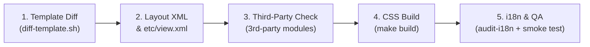

# Hyvä Theme Upgrade — Page Flow Tracking Matrix

> **This is a project template.** Copy this file into your project and fill in the actual page flows, modules, and files for your specific child theme. Delete or keep sections as relevant.

---

## Project Configuration

| Field | Value |
|-------|-------|
| **Theme** | `Vendor/YourTheme` |
| **From version** | `x.x.x` |
| **To version** | `x.x.x` |
| **Tailwind** | v3 → v4 |
| **CSS Freeze** | Yes / No |
| **Locales** | `en_US`, ... |

---

## Standard 5-Step SOP per Page / Flow

For every page and module in this matrix, follow these 5 standardized steps:

1. **Step 1 — Template Diff:** Run `diff-template.sh` for each override. Adopt new PHP-rendered structures and updated Alpine patterns.
2. **Step 2 — Layout XML & view.xml:** Verify block names, ViewModels, and new layout containers.
3. **Step 3 — Third-Party Compatibility:** Audit overrides from 3rd-party modules.
4. **Step 4 — CSS Build Verification:** Run `make build`. Verify 0 compilation errors.
5. **Step 5 — i18n & QA:** Run `audit-i18n.py`. Verify CLS = 0 on PDP/PLP. Smoke test.

---

## Status Legend

| Symbol | Meaning |
|--------|---------|
| `[x]` | Done — reviewed, updated, tested |
| `[ ]` | Pending — not yet started |
| `[~]` | In progress |
| `[s]` | Skipped — not applicable for this project |

---

## Flow 1: Global / Foundation

* **Goal:** Global layout, responsive menus, search, notifications, Alpine base plugins.

| Module | File Path | Type | Focus / Upgrade Check | Status |
| :--- | :--- | :--- | :--- | :--- |
| `Magento_Theme` | `layout/default.xml` | XML | Base layout structure | `[ ]` |
| `Magento_Theme` | `templates/html/header.phtml` | PHTML | Sticky header, mobile menu | `[ ]` |
| `Magento_Theme` | `templates/page/js/plugins/htmldialog.phtml` | PHTML | HTML Dialog 2.3.0 (`modeless`) | `[ ]` |
| *(add your files)* | | | | |

---

## Flow 2: Product Detail Page (PDP)

* **Goal:** PHP-rendered Swatches & Gallery (Hyvä 1.5.1+), eliminate CLS.

> [!WARNING]
> **High-risk:** Any 3rd-party swatch/gallery overrides must be verified against the new PHP-rendered approach.

| Module | File Path | Type | Focus / Upgrade Check | Status |
| :--- | :--- | :--- | :--- | :--- |
| `Magento_Catalog` | `templates/product/view/gallery.phtml` | PHTML | PHP gallery + `gallery.additional` | `[ ]` |
| `Magento_Swatches` | `templates/product/view/renderer.phtml` | PHTML | `.swatch-option` CSS component | `[ ]` |
| *(add your files)* | | | | |

---

## Flow 3: Product List Page (PLP) & Search

* **Goal:** Product cards, filters, search results.

| Module | File Path | Type | Focus / Upgrade Check | Status |
| :--- | :--- | :--- | :--- | :--- |
| `Magento_Catalog` | `templates/product/list.phtml` | PHTML | Product card layout | `[ ]` |
| *(add your files)* | | | | |

---

## Flow 4: Cart & Mini-cart

* **Goal:** Cart totals, mini-cart drawer, Ajax add-to-cart.

| Module | File Path | Type | Focus / Upgrade Check | Status |
| :--- | :--- | :--- | :--- | :--- |
| `Magento_Checkout` | `templates/cart/form.phtml` | PHTML | Cart form, coupon, shipping | `[ ]` |
| *(add your files)* | | | | |

---

## Flow 5: Checkout

* **Goal:** Checkout steps, address, payment, Magewire components.

| Module | File Path | Type | Focus / Upgrade Check | Status |
| :--- | :--- | :--- | :--- | :--- |
| *(add your files)* | | | | |

---

## Flow 6: Customer Account

* **Goal:** Login, registration, dashboard, order history.

| Module | File Path | Type | Focus / Upgrade Check | Status |
| :--- | :--- | :--- | :--- | :--- |
| `Magento_Customer` | `templates/form/login.phtml` | PHTML | `isSubmitting` guard, bfcache | `[ ]` |
| *(add your files)* | | | | |

---

## Flow 7: CMS, Brand Pages & 3rd-Party Vendor Overrides

* **Goal:** CMS pages, Hyvä CMS `auto_attributes`, PageBuilder, and 3rd-party compatibility modules that were updated in `vendor/`.
* **Vendor Alignment Strategy:**
  1. Run `./run.sh vendor` to discover which 3rd-party module templates were updated upstream in `vendor/`.
  2. Add those overridden templates to the table below.
  3. Diff and update child-theme overrides to match vendor updates.

| Module | File Path | Type | Focus / Upgrade Check | Status |
| :--- | :--- | :--- | :--- | :--- |
| `Magento_Cms` | `layout/cms_page_view.xml` | XML | CMS page layout & layout containers | `[ ]` |
| `Hyva_Cms` *(if used)* | `layout/hyva_cms_page_view.xml` | XML | Hyvä CMS auto_attributes, Tailwind JIT cache | `[ ]` |
| *(3rd-Party Module)* | *(templates/path/to/file.phtml)* | PHTML | Upstream vendor updates (diff vs vendor/) | `[ ]` |
| *(add your files)* | | | | |

---

## Cross-Functional Smoke Test (Run After Each Flow)

| # | Test | Expected Result |
|---|------|-----------------|
| 1 | **Add to cart** from a page in the flow | Toast appears, header counter increments, mini-cart drawer opens |
| 2 | **Login / Logout** | Header greeting updates correctly |
| 3 | **Select swatch on PDP** | Gallery image switches, price updates |

---

## Final Acceptance Checklist

* [ ] `python3 scripts/audit-theme.py` exits with code 0
* [ ] `make build` produces `web/css/styles.css` with 0 errors
* [ ] All flows marked `[x]` Done in this matrix
* [ ] Cross-functional smoke test passes on staging
* [ ] PageSpeed CLS = 0 on PDP and PLP
* [ ] All locales deploy without errors
